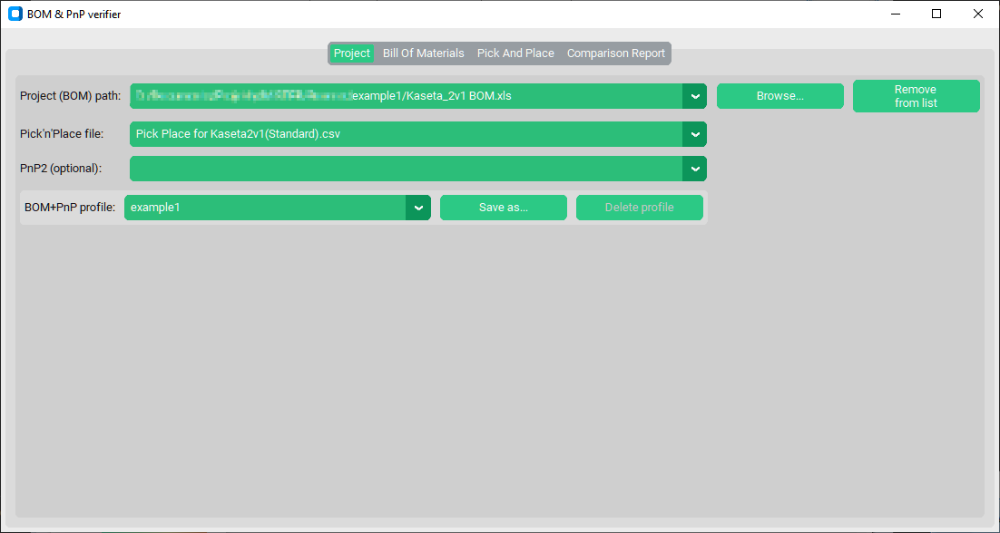
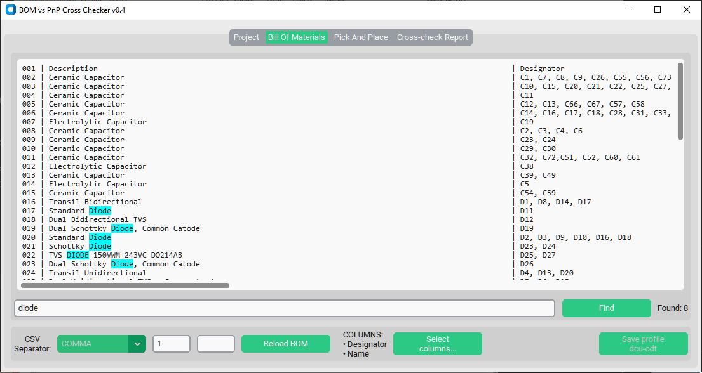
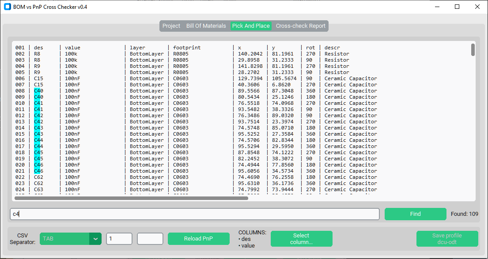
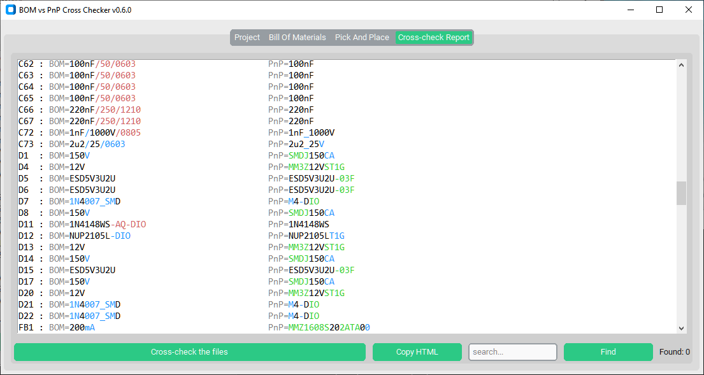

# BOM and PnP verifier

The purpose of this project is to help an electronic manufacturer in preparation of the new <abbr title="Printed Circuit Board">PCB</abbr> elements.

It reads the <abbr title="Bill Of Materials">BOM</abbr> and the accompanying <abbr title="Pick And Place">PnP</abbr> files, performing cross-checking to ensure if those files contents matches.

Project selection:


BOM preview:


PnP preview:


Report:


The following checks are performed:

* BOM contains element that is missing in the PnP file
* PnP contains reference to element that is not present in the BOM
* Part comment (value) differs between BOM and PnP files

## Supported formats

* [BOM](. "Bill Of Materials")
  * .xls
  * .xlsx
  * .ods
  * .csv
* [PnP](. "Pick And Place")
  * .xls
  * .xlsx
  * .ods
  * any other extension - considered as a CSV file

## Prerequisites

[Python for Windows with addons](https://www.python.org/).
Remember to check these options:

* pip
* tcl\tk
* Add Python to environment variables

To install required libraries, open the PowerShell and:

```ps1
# .xls reader, .xlsx reader, .ods reader, UI lib, natural sorting
pip install xlrd openpyxl odfpy customtkinter natsort
```

## How to run

From PowerShell:

```ps1
python.exe src/app.py
```

## Trouble shooting

* *ModuleNotFoundError: No module named 'tkinter'*

  `tkinter` was not installed together with the Python -
  follow the instructions [here](https://bobbyhadz.com/blog/python-no-module-named-tkinter).
*
