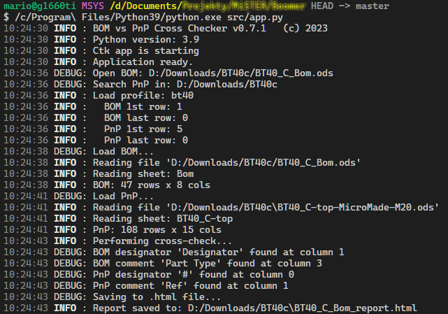

# BOM and PnP verifier

The purpose of this project is to help an electronic manufacturer in preparation of the new <abbr title="Printed Circuit Board">PCB</abbr> elements.

It reads the <abbr title="Bill Of Materials">BOM</abbr> and the accompanying <abbr title="Pick And Place">PnP</abbr> files, performing cross-checking to ensure if those files contents matches.

Project selection:


BOM preview:


PnP preview:


Report:


The following checks are performed:

* BOM contains element that is missing in the PnP file
* PnP contains reference to element that is not present in the BOM
* Part comment (value) differs between BOM and PnP files

## Supported formats

* [BOM](. "Bill Of Materials")
  * .xls
  * .xlsx
  * .ods
  * .csv
* [PnP](. "Pick And Place")
  * .xls
  * .xlsx
  * .ods
  * any other extension - considered as a CSV file

> NOTE
>
> If xls/xlsx/ods file contains several sheets, only the first one will be used.

## Prerequisites

### Python

[Python for Windows with addons](https://www.python.org/).
Remember to check these options:

* pip
* tcl\tk
* Add Python to environment variables

Minimum required version is **Python 3.9**.

### Libraries

To install required libraries, open the PowerShell and:

```ps1
# .xls reader, .xlsx reader, .ods reader, UI lib, natural sorting, http requests, image formats
pip install xlrd openpyxl odfpy customtkinter natsort requests pillow
# using local copy of fixed:
#   tkhtmlview - HTML widgets,
#   klembord - clipboard
```

## How to run

From PowerShell:

```ps1
python.exe src/app.py
```

To get colored logs, use Linux-like terminal, eg. [MSys2](msys2.org/), but still using the Windows installation of the Python:

```sh
$ /c/Program\ Files/Python39/python.exe src/app.py
```



## Trouble shooting

* *ModuleNotFoundError: No module named 'tkinter'*

  `tkinter` was not installed together with the Python -
  follow the instructions [here](https://bobbyhadz.com/blog/python-no-module-named-tkinter).
* *ERROR: Cannot load BOM: 'utf-8' codec can't decode byte*

  Only UTF-8 files are accepted; if the BOM or PnP file uses ANSI or WINDOWS encoding, use `Notepad++` or other editor to change the encoding to UTF-8
*

## Unit tests

Uses [pytest](https://docs.pytest.org/en/latest/):

```ps1
pip install pytest
cd tests
# run all
pytest
# run single test
pytest test_csv_reader.py::test_no_file
# print everything
pytest -s
```

### Tests coverage

Uses [Coverage](https://coverage.readthedocs.io/en/):

```ps1
pip install coverage
cd tests
coverage run -m pytest
coverage report --omit "test_*"
# Name                 Stmts   Miss  Cover
# ----------------------------------------
# src/csv_reader.py       48      9    81%
# src/ods_reader.py       24      1    96%
# src/text_grid.py        49     27    45%
# src/xls_reader.py       24      1    96%
# src/xlsx_reader.py      23      0   100%
# ----------------------------------------
# TOTAL                  243     38    84%
coverage html --omit "test_*"
# open tests\htmlcov\index.html
```
